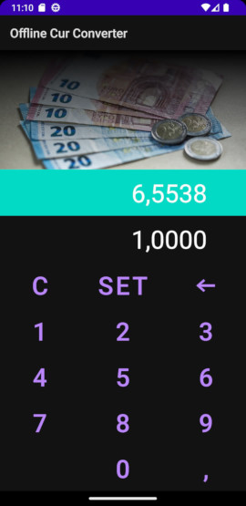

# Offline Cur Converter
  
An android app for converting any manual added currency into any manual added currency. 

This project is licensed under the terms of the GNU GPLv2 license.

This project is fork of Euro konverter.
[https://eurokonverter.com](https://eurokonverter.com)  

# Screenshots

# Ussage

By default, the currency rate is set to 1 to 2. 
To change the rate, enter the value of one unit of currency in another and press the SET button. 
After that the rate value will be set: <your value> = 1

The program does not remember the previous rate
